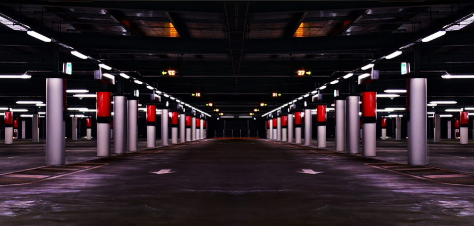
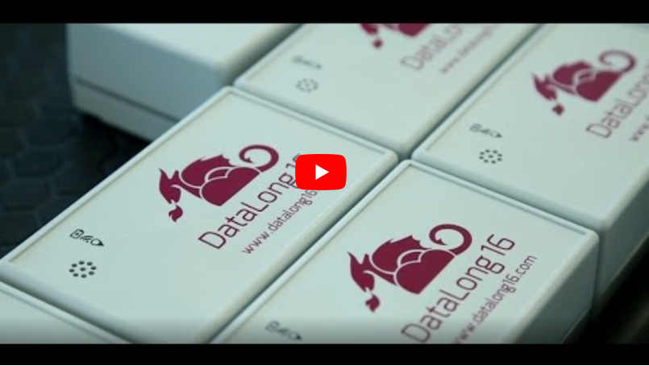

# Práctica de visualización de usos del IoT

## Objetivo

Para la realización de esta práctica los alumnos se reunirán en grupos de 2 o 3 personas para debatir unos determinados casos donde se pueda aplicar el IoT y qué utilidad dar a los datos recogidos por los sensores. Es importante entender que el IoT puede ser crucial en determinados casos pero que un exceso de sensorización puede no aportar valor añadido si los datos no son bien tratados y/o irrelevantes. 

## Caso 1: Gestión de un parking

Imagine que Ud. es el gerente de un parking subterráneo de 5 plantas. El Parking no cuenta con ningún tipo de sensor y debido a que Ud. ha atendido a este curso decide sensorizar su negocio. ¿Añadiría algún sensor a su planta? En tal caso, explique cómo emplearía los datos obtenidos.

## Caso 2: Paquetería frigorífica

Imagine ahora que Ud. forma parte de una empresa especializada en el envió de paquetes frigoríficos. Desde hace años muchas de las empresas especializadas en  paquetería emplean sensores GPS para la localización de sus envíos. Qué podríamos añadir a estos datos de GPS para que tanto el repartidor como el proveedor y cliente pudieran aprovechar de mejor manera los datos del paquete.

## Caso 3: Gestión de una sala de cine
Ud. es ahora el gerente de una sala de cines de Madrid. Despúes de atender este curso, ha decidido invertir en sensorizar por completo la sala de cine. ¿Es una buena idea? Y si es así, ¿dónde colocaría los sensores y para qué?

***

## Resolución del caso 1: Gestión de un parking

A día de hoy existen multipes ejemplos de sensorización a la hora de aparcar los coches. Los sensores informar a los conductores mediante luces verdes y rojas sobre el estado las plazas de aparcamiento. Además, pueden colocarse sensores de detección de proximidad que indiquen al conductor mediante un sonido si va a chocar con una columna o pared. 

En cuanto a los datos que recibimos de los sensores, se puede resaltar que son de gran utilidad para la gestión del parking. Estos datos se pueden analizar de manera que obtengamos las tendencias de los usuarios para aparcar y de esta manera gestionar de una mejor manera la disponibilidad de los mismos. Por otro lado, se podrían resaltar datos como el tiempo medio de aparcamiento por usuario, la disponibilidad de las plazas por época del año etc. Todos estos datos, nos podrán ayudar a gestionar de una mejor manera las tarifas y usus de nuestro complejo.

## Resolución del caso 2: Paquetería frigorífica

## Caso 3: Gestión de una sala de cine

Verdaderamente no es necesario sensorizar una sala de cine. La información que aporta el colocar unos sensores bajo las sillas puede ser obtenida mediante la reserva de los mismos por internet y no existe otro objeto a sensorizar en la sala. Por tanto, estamos ante un caso donde se ha invertido sin necesidad en colocar los sensores. 

Es importante recordar que la sobre-sensorización existe a día de hoy. Es imprescindible analizar qué sensores añadirán valor a nuestros productos y/o servicios antes de colocarlos.

